<!-- ═══════════════════════════════════════════════════════════════════
     KCN_LAB :: PROFILE README  ·  KANHU NAYAK  ·  KCN-369
     Animated assets live in /assets (hand-built SVG, no external host).
     Live cards in /profile are refreshed by .github/workflows/profile-assets.yml
     ═══════════════════════════════════════════════════════════════════ -->

<div align="center">



<a href="https://github.com/KCN-369">
  
</a>

<br/>


<a href="https://github.com/KCN-369?tab=followers"></a>


</div>


<h2 align="center">◈ IDENTITY</h2>

<div align="center">
  
</div>

> **Curiosity defined in binary terms `(0/1)` ::**<br/>
> `0` ≈ Stay simple, accept weakness and give up<br/>
> `1` ≈ Do whatever it takes to satisfy your curiosity **!!**


<h2 align="center">◈ SYSTEM STATUS</h2>

<div align="center">
  
</div>


<h2 align="center">◈ TECH STACK</h2>

<div align="center">

<sub><code>LANGUAGES</code></sub><br/><br/>


<br/><br/><sub><code>SCIENTIFIC / ML</code></sub><br/><br/>

<br/>


<br/><br/><sub><code>WEB / ENGINEERING</code></sub><br/><br/>


</div>

<details>
<summary><b>◈ INTEREST MATRIX</b> <sub>— click to expand</sub></summary>
<br/>

| DOMAIN | STATE | | DOMAIN | STATE |
|:--|:--|:-:|:--|:--|
| `PHYSICS` | 🟢 `ACTIVE` | | `COMPUTER VISION` | 🟡 `EXPLORING` |
| `ARTIFICIAL INTELLIGENCE` | 🟡 `EXPLORING` | | `QUANTUM COMPUTING` | 🟡 `EXPLORING` |
| `MACHINE LEARNING` | 🟠 `BUILDING` | | `SCIENTIFIC COMPUTING` | 🔵 `LEARNING` |
| `DEEP LEARNING` | 🔵 `LEARNING` | | `ROBOTICS` | 🟡 `EXPLORING` |
| `WEB DEVELOPMENT` | 🟠 `BUILDING` | | `OPEN SOURCE` | 🟠 `BUILDING` |
| `RESEARCH` | 🟣 `ONGOING` | | | |

```text
EXPLORATION VECTOR :: PHYSICS → MATHEMATICS → PROGRAMMING → AI/ML → DEEP LEARNING → SCIENTIFIC COMPUTING → RESEARCH
```

</details>


<h2 align="center">◈ CURRENT FOCUS</h2>

<div align="center">
  
</div>


<h2 align="center">◈ PROJECT DATABASE · RESEARCH CORE</h2>

<div align="center">
  
</div>


<h2 align="center">◈ JOURNEY</h2>

<div align="center">
  
</div>

<h3 align="center">◈ THINKING PROTOCOL</h3>

<p align="center">
  <i>“Thinking is difficult — but systematic deep thinking<br/>for re-architecting an existing system is rare.”</i>
</p>


<h2 align="center">◈ GITHUB TELEMETRY</h2>

<div align="center">







</div>


<h2 align="center">◈ CONNECT</h2>

<div align="center">

<a href="https://www.linkedin.com/in/kanhu-nayak-369kcn"></a>
<a href="https://x.com/KCN3210"></a>
<a href="https://huggingface.co/kcn-369"></a>
<a href="https://orcid.org/0009-0004-9507-6794"></a>
<a href="mailto:kcn3210@gmail.com"></a>

<br/><br/>



</div>
