<!-- ═══════════════════════════════════════════════════════════════════
     KCN_LAB :: PROFILE README  ·  KANHU NAYAK  ·  KCN-369
     LIGHT PROTOCOL · PROFILE_v2
     · static artwork in /assets        → scripts/build_assets.py
     · live cards in /profile           → scripts/profile_cards.py
     · interactive 3D viewer in /docs   → GitHub Pages
     Everything is generated inside this repository — no theme switcher,
     no third-party snake, no fake entries.
     ═══════════════════════════════════════════════════════════════════ -->

<div align="center">

<a href="https://github.com/KCN-369">
  
</a>

<br/>

<a href="https://github.com/KCN-369">
  
</a>

<br/>

<a href="https://github.com/KCN-369">
  
</a>

<br/>


<a href="https://github.com/KCN-369?tab=followers"></a>


</div>


<h2 align="center">◈ IDENTITY</h2>

<div align="center">
  
</div>

> **Curiosity defined in binary terms `(0/1)` ::**<br/>
> `0` ≈ Stay simple, accept weakness and give up<br/>
> `1` ≈ Do whatever it takes to satisfy your curiosity **!!**

<h4 align="center"><em>&ldquo;Curiosity kills comfortablity&rdquo;</em><br/><sub>~ kcn</sub></h4>


<h2 align="center">◈ TECH STACK · EVERY TILE OPENS ITS OFFICIAL DOCS ↗</h2>

<div align="center">

<sub>28 modules indexed · hover a tile to engage its interface · click to open the official documentation</sub>

<br/>

<sub><code>LANGUAGES</code></sub><br/><br/>

<a href="https://docs.python.org/3/" title="Python — official documentation"></a>
<a href="https://en.cppreference.com/w/" title="C — official documentation"></a>
<a href="https://developer.mozilla.org/en-US/docs/Web/JavaScript" title="JavaScript — official documentation"></a>
<a href="https://www.typescriptlang.org/docs/" title="TypeScript — official documentation"></a>
<a href="https://developer.mozilla.org/en-US/docs/Web/HTML" title="HTML — official documentation"></a>
<a href="https://developer.mozilla.org/en-US/docs/Web/CSS" title="CSS — official documentation"></a>

<br/><br/>
<sub><code>MACHINE LEARNING</code></sub><br/><br/>

<a href="https://pytorch.org/docs/stable/" title="PyTorch — official documentation"></a>
<a href="https://www.tensorflow.org/api_docs" title="TensorFlow — official documentation"></a>
<a href="https://scikit-learn.org/stable/" title="scikit-learn — official documentation"></a>
<a href="https://docs.opencv.org/4.x/" title="OpenCV — official documentation"></a>
<a href="https://huggingface.co/docs" title="Hugging Face — official documentation"></a>

<br/><br/>
<sub><code>DATA · SCIENTIFIC COMPUTING</code></sub><br/><br/>

<a href="https://numpy.org/doc/stable/" title="NumPy — official documentation"></a>
<a href="https://pandas.pydata.org/docs/" title="pandas — official documentation"></a>
<a href="https://matplotlib.org/stable/" title="Matplotlib — official documentation"></a>
<a href="https://docs.scipy.org/doc/scipy/" title="SciPy — official documentation"></a>
<a href="https://docs.jupyter.org/" title="Jupyter — official documentation"></a>
<a href="https://docs.anaconda.com/" title="Anaconda — official documentation"></a>

<br/><br/>
<sub><code>QUANTUM · RESEARCH</code></sub><br/><br/>

<a href="https://docs.quantum.ibm.com/" title="Qiskit — official documentation"></a>
<a href="https://www.latex-project.org/help/documentation/" title="LaTeX — official documentation"></a>
<a href="https://info.arxiv.org/help/index.html" title="arXiv — official documentation"></a>

<br/><br/>
<sub><code>TOOLS · ENVIRONMENT</code></sub><br/><br/>

<a href="https://git-scm.com/doc" title="Git — official documentation"></a>
<a href="https://www.kernel.org/doc/html/latest/" title="Linux — official documentation"></a>
<a href="https://www.gnu.org/software/bash/manual/bash.html" title="Bash — official documentation"></a>
<a href="https://docs.docker.com/" title="Docker — official documentation"></a>
<a href="https://code.visualstudio.com/docs" title="VS Code — official documentation"></a>

<br/><br/>
<sub><code>WEB · VERSION HOST</code></sub><br/><br/>

<a href="https://react.dev/learn" title="React — official documentation"></a>
<a href="https://nextjs.org/docs" title="Next.js — official documentation"></a>
<a href="https://docs.github.com/" title="GitHub — official documentation"></a>

</div>

<details>
<summary><b>◈ INTEREST MATRIX</b> <sub>— click to expand</sub></summary>
<br/>

| DOMAIN | STATE | | DOMAIN | STATE |
|:--|:--|:-:|:--|:--|
| `PHYSICS` | 🟢 `ACTIVE` | | `COMPUTER VISION` | 🟡 `EXPLORING` |
| `ARTIFICIAL INTELLIGENCE` | 🟡 `EXPLORING` | | `QUANTUM COMPUTING` | 🟡 `EXPLORING` |
| `MACHINE LEARNING` | 🟠 `BUILDING` | | `SCIENTIFIC COMPUTING` | 🔵 `LEARNING` |
| `DEEP LEARNING` | 🔵 `LEARNING` | | `ROBOTICS` | 🟡 `EXPLORING` |
| `WEB DEVELOPMENT` | 🟠 `BUILDING` | | `OPEN SOURCE` | 🟠 `BUILDING` |
| `RESEARCH` | 🟣 `ONGOING` | | | |

```text
EXPLORATION VECTOR :: PHYSICS → MATHEMATICS → PROGRAMMING → AI/ML → DEEP LEARNING → SCIENTIFIC COMPUTING → RESEARCH
```

</details>


<h2 align="center">◈ SYSTEM STATUS</h2>

<div align="center">
  
</div>


<h2 align="center">◈ CURRENT FOCUS</h2>

<div align="center">
  
</div>


<h2 align="center">◈ PROJECT DATABASE · RESEARCH CORE</h2>

<div align="center">
  
</div>


<h2 align="center">◈ JOURNEY</h2>

<div align="center">
  
</div>

<h3 align="center">◈ THINKING PROTOCOL</h3>

<p align="center">
  <i>“Thinking is difficult — but systematic deep thinking<br/>for re-architecting an existing system is rare.”</i>
</p>


<h2 align="center">◈ GITHUB TELEMETRY · LIVE DATA</h2>

<div align="center">

<a href="https://kcn-369.github.io/KCN-369" title="open the interactive 3D viewer (drag to rotate, scroll to zoom)">
  
</a>

<br/>


<br/>


<br/>


</div>


<h2 align="center">◈ CONNECT</h2>

<div align="center">

<a href="https://github.com/KCN-369"></a>
<a href="https://www.linkedin.com/in/kanhu-nayak-369kcn"></a>
<a href="https://x.com/KCN3210"></a>
<a href="https://huggingface.co/kcn-369"></a>
<a href="https://orcid.org/0009-0004-9507-6794"></a>
<a href="mailto:kcn3210@gmail.com"></a>

<br/><br/>


</div>
